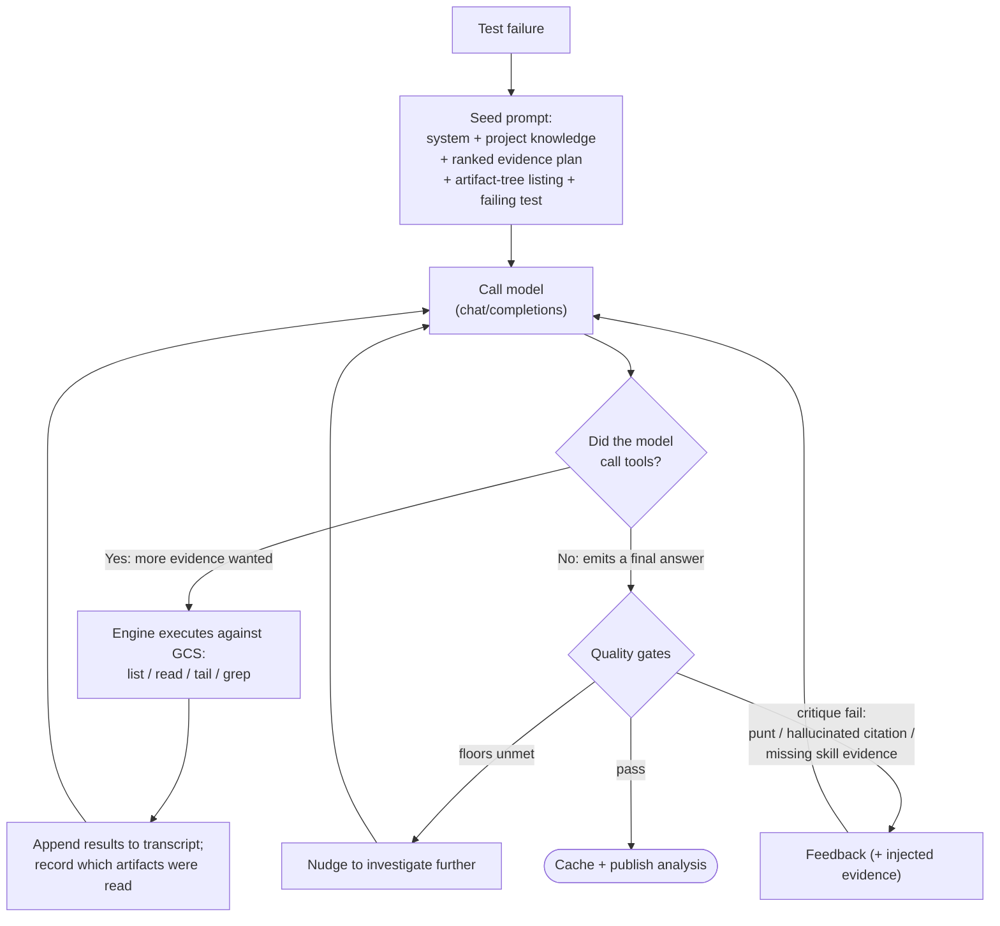

# Agentic AI analysis (tool calling)

The agentic loop is the engine's single analysis approach: the LLM decides which
artifacts to read instead of pre-fetching a fixed set. The model calls
function-calling tools that browse the build's GCS artifact tree:
`list_artifacts`, `read_artifact`, `tail_artifact`, `grep_artifact`,
`find_artifacts`, and `verify_timeline` (which returns a log's timestamped
events ordered in time, so the model can check causal ordering).
Optional tier-2 tools add Kubernetes-shaped discovery (`discover_clusters`,
`discover_controllers`, etc.).

There is nothing to enable: if `-ai` is on and the endpoint supports
function calling, every failure is analyzed by the agentic loop. The model
browses everything itself via the registered tools; the per-failure prompt
is just the failing test's context.

## Runtime ownership

The fetcher and worker run the dashboard-owned `FailureAnalyzer` directly. The
same Go implementation owns provider behavior, tools, evidence planning,
critique, cache acceptance, private traces, and result schemas on Pages and
Kubernetes.

## Endpoint requirements

Agentic analysis requires an OpenAI-compatible Chat Completions or Responses
endpoint with function calling. Chat uses `tools` and `tool_calls`; Responses
uses function-call and `function_call_output` items. Select the wire contract with
`ai.api`. Verified providers:

- **GitHub Copilot** (`api.githubcopilot.com`) — supported.
- **OpenAI**: supported on models that expose function calling.
- **Azure OpenAI** — supported on tool-calling-capable deployments.
- **Ollama / vLLM / NIMs** — supported per-model; check your model card.

There is no tools-free fallback: an endpoint that rejects function calling
surfaces as an explicit "AI analysis unavailable" summary in the dashboard
rather than silently degrading.

## Configuration

All knobs are inlined directly under `ai:` in `project.yaml`. `endpoint` and
`model` are required when AI is enabled (the engine has no default provider);
every other field is optional and runs with engine defaults when unset:

```yaml
ai:
  endpoint: ...                 # required when AI is enabled; or env AI_ENDPOINT
  model: ...                    # required when AI is enabled; or env AI_MODEL
  source_repo:                  # optional read-only source, defaults to branding.source_repo
    owner: my-org
    name: my-project
  consumer_skills:              # optional mounted-bundle requirement
    required: false
    minimum_count: 0
  cache_generation: ""          # optional reversible full-reanalysis namespace
  concurrency: 1                # parallel analyses (raise for endpoints you control)
  max_iters: 15                 # tool-call rounds per failure
  timeout: 5m                   # per-failure agentic wall-clock timeout
  min_tool_calls: 2             # minimum tool calls before a final answer is accepted
  min_gcs_bytes: 0              # minimum GCS bytes fetched before a final answer is accepted
  single_tool_call: false       # send at most one tool call per turn (for single-tool-call-only models)
  critique:
    max_retries: 0              # default; positive values enable one bounded repair
  tools: [filesystem, k8s]      # registered tool groups exposed to the model
```

The defaults target a strong hosted model (Copilot / OpenAI / Claude) and are
conservative enough that you almost never need to tune them. The further your
model is from that (smaller context window, weaker tool calling, an
open-weights chat template), the more of the optional guardrails you want on;
see [Tuning by model tier](#tuning-by-model-tier) for recommended combinations
and copy-paste presets. Each field below is the one-line summary; see
[How it works](#how-it-works) for the underlying mechanics. The byte budgets (model output, compaction, and
the GCS fetch ceiling) are **not** configurable: the first two auto-size from
the endpoint's context window and the GCS ceiling is a fixed engine safety cap
(see [Automatic budget sizing](#automatic-budget-sizing)).

The effective tool selection also selects diagnostic profiles. The engine-owned
Prow profile is always enabled. The provider-neutral Kubernetes profile is
enabled with the `k8s` group or an individual `k8s.*` tool. Set
`tools: [filesystem]` to opt out of Kubernetes recipes for projects where they
do not apply. Consumer `skills/*.yaml` recipes join the selected built-ins in
one merged contract.

The merged recipes are sorted globally by priority descending and ID ascending,
regardless of source. They are not inserted as ordered prompt layers. After the
model produces a draft, only recipes whose triggers match that draft contribute
procedures and required-evidence groups. Per-failure artifact reads satisfy
those groups. No recipe can replace or override the universal engine contract.

### `max_iters`

Tool-call rounds per failure. Default `15`. Lower it first if the model loops
without converging. Critique retries add iterations on top of this.

### `timeout`

Per-failure wall-clock cap. Default `5m`. Hitting it cancels the in-flight
request and errors the analysis out (unlike a budget cap, which forces a
graceful finalize), so set it generously for slow or contended endpoints.

This is the only bound on an individual chat request: the engine sets no fixed
per-request HTTP timeout, so a single slow response (e.g. a reasoning model's
decode, or a self-hosted endpoint under load) is capped only by this value.
Size it to comfortably exceed the slowest single response you expect, not just
the whole-loop budget.

### `min_tool_calls`

Minimum tool calls before a final answer is accepted. Default `2`. Below-floor
finals are published but not cached, so the next run retries. Raise it to `3`
or higher for weaker open-weights models that finalize from the prompt alone.
See [Investigation floors](#investigation-floors).

### `min_gcs_bytes`

Minimum bytes fetched from GCS before a final answer is accepted. Default `0`
(no floor). Complements `min_tool_calls` because call count alone is gameable
(a model can satisfy it with cheap `list_artifacts` calls or tiny reads).
Complete coverage of a matched initial evidence plan also satisfies this floor,
without relaxing any other gate. `200000` (200 KB) is a reasonable starting
value for weaker models. See [Investigation floors](#investigation-floors).

### `critique`

The deterministic critique gate always runs. It rejects punt-shaped and
ungrounded drafts. `max_retries`, which defaults to `0`, controls eligibility for the single
bounded deterministic repair operation. `0` evaluates the draft once but makes
no critique repair model request. Positive values remain subject to context and
time-headroom guards. A
still-failing draft is published uncached. See
[The critique gate](#the-critique-gate).

### `single_tool_call`

Send at most one tool call per assistant turn. Off by default. Required for
endpoints whose chat template rejects multiple tool calls in one assistant
message (e.g. the stock Llama 3.x Instruct template); leave it off for
providers that support parallel tool calls (Copilot, OpenAI, Claude). See
[Single tool call](#single-tool-call).

### `tools`

Which registered tool groups the model can call. Defaults to
`[filesystem, k8s]`. Narrow to `[filesystem]` for non-Kubernetes projects
whose artifact tree has no cluster resource YAMLs (the k8s tier-2 tools would
return empty).

### `concurrency`

How many failures to analyze in parallel. Defaults to `1` (sequential). Raise
only for endpoints you control; a shared, rate-limited provider can 429 under
parallelism. See [Parallel analysis](#parallel-analysis).

---

## Tuning by model tier

The defaults assume a frontier hosted model. As you move to smaller or
open-weights models, turn on the optional guardrails that compensate for the
two things weaker models do worst: they finalize before they have investigated,
and they emit punt-shaped or ungrounded answers. The knobs group by what each
one compensates for:

- **Investigation depth** (`min_tool_calls`, `min_gcs_bytes`): a weak model's
  most common failure is finalizing from the prompt alone, or after a couple of
  cheap `list_artifacts` calls. The floors reject a too-early final and
  re-prompt. The critique gate and its evidence injection, which repair
  punt-shaped fixes and hallucinated citations, always run, so you do not tune
  them.
- **Protocol quirks** (`single_tool_call`): some open-weights chat templates
  reject more than one tool call per assistant turn.
- **Throughput** (`concurrency`): a property of the *endpoint*, not the model.
  Keep it `1` on a shared or rate-limited provider regardless of model tier;
  raise it only for an endpoint you control.

You never size the byte budgets yourself: the engine auto-sizes them from the
endpoint's reported context window (see
[Automatic budget sizing](#automatic-budget-sizing)), so a small-context model
is handled automatically.

### Smaller or weaker models: what to turn on

In rough order of impact when stepping down from a frontier hosted model:

1. **Raise the investigation floors.** The default `min_tool_calls: 2` already
   forces two tool calls before a final; step up to `min_tool_calls: 3` and add
   `min_gcs_bytes: 200000` (200 KB), then raise gradually if analyses still
   finalize shallow. The byte floor matters because the call-count floor alone
   is gameable with cheap listings (see
   [Investigation floors](#investigation-floors)).
2. **Set `single_tool_call: true` only if the model's chat template rejects
   parallel tool calls.** Required for the stock Llama 3.x Instruct template
   (it raises "This model only supports single tool-calls at once!", surfaced
   as a 500). Leave it off for Qwen3-Coder, Copilot, OpenAI, and Claude, which
   emit parallel calls cleanly; forcing it there only slows investigation.

The critique gate and its evidence injection run on every model tier, so there
is nothing to turn on for them: punt-shaped fixes and hallucinated citations
are repaired automatically.

### Settings by model tier

| Option | Strong hosted (Claude / GPT / Copilot) | Strong open-weights, large ctx | Small / weak open-weights |
|---|---|---|---|
| `min_tool_calls` | `2` (default) | `5` | `3` |
| `min_gcs_bytes` | off (`0`) | `500000` | `200000` |
| `single_tool_call` | off | off | on *if template requires* |
| `max_iters` | `15` (default) | `30` | `15` |
| `concurrency` | `1` (shared provider) | `4` (dedicated endpoint) | endpoint-dependent |

### Presets

Every preset still requires `endpoint` and `model` (omitted below for brevity);
set them in `project.yaml` or via `AI_ENDPOINT` / `AI_MODEL`.

**Strong hosted model** (e.g. Claude / GPT / Gemini via Copilot or OpenAI). The
tuning defaults are enough here, so set just the endpoint, model, and tools. A
frontier model investigates deeply and writes concrete fixes with only the
default floors, and the provider is shared and rate-limited, so leave
`concurrency` at `1`.

```yaml
ai:
  endpoint: "https://api.githubcopilot.com/chat/completions"
  model: "claude-sonnet-4.6"
  tools: [filesystem, k8s]
  # everything else defaults: min_tool_calls 2, concurrency 1,
  # single_tool_call off.
```

**Strong open-weights, large context, dedicated endpoint** (e.g.
Qwen3-Coder-480B at a 256K window on self-hosted vLLM / TRT-LLM / Dynamo). This
is the Qwen dashboard. The endpoint is dedicated and batches concurrent
requests, so concurrency pays off, and the raised floors keep a real
investigation bar.

```yaml
ai:
  concurrency: 4            # dedicated batching endpoint, ~4x faster cold fetch
  max_iters: 30             # heavy-tail analyses were iteration-bound at 20
  min_tool_calls: 5         # floors: keep a real investigation bar
  min_gcs_bytes: 500000
  tools: [filesystem, k8s]
  # single_tool_call left off: Qwen3-Coder emits parallel tool calls cleanly.
```

**Small or weak open-weights, modest context** (e.g. a 32-40K Llama 3.x or a
smaller MoE). Recommended starting point, then tune from the run telemetry
(cached `tool_calls` / `gcs_bytes` and the critique pass rate).

```yaml
ai:
  max_iters: 15             # default; raise only if analyses are iteration-bound
  min_tool_calls: 3         # lower floor than the 480B; raise gradually
  min_gcs_bytes: 200000
  single_tool_call: true    # ONLY if the chat template rejects parallel calls
                            # (stock Llama 3.x); drop it otherwise
  tools: [filesystem, k8s]
```

---

## How it works

The mechanics below are the dashboard-owned analyzer used by both Pages and
Kubernetes deployments.

### The loop at a glance

Each failure is analyzed by a tool-calling loop. The engine seeds a prompt, then
calls the model repeatedly: every turn the model either requests more tools (it
keeps investigating) or returns a tools-free answer (it finalizes). The quality
gates run only on the finalize branch and can push a weak answer back into the
loop.



The model is a stateless endpoint, so the engine re-sends the whole transcript
(`messages[]` plus the tool schemas) on every call and carries the memory itself.
Tool calls are not a rejected output: they are the model continuing its
investigation. The model may finalize on any turn; the prompt encourages drilling,
the floors enforce a minimum, and `max_iters` / the evidence cap bound the maximum.
The sections below detail each box.

### Automatic budget sizing

The agentic loop bounds how much tool output the model accumulates (the
evidence cap) and reserves request headroom before every provider call.
**Neither is configurable**. At startup it GETs the endpoint's `/v1/models`
and reads the served model's `context_window` in tokens. The engine reserves
space for provider framing, completion output, a finalization response, and
evidence-ledger restoration. It then uses a deliberately conservative
one-token-per-serialized-byte estimate for the request body, including Tool
schemas. This overestimates normal prose and dense CI data rather than relying
on a provider-specific tokenizer or an unsafe bytes-per-token average.

The same guard applies to investigation turns, floor nudges, deterministic
critique retries, evidence injection, semantic-judge retries, and forced
finalization. Old tool-result bodies are compacted to recover room while
preserving Tool-call/result pairs and the most recent repair instructions. If
compaction cannot make a request fit, the loop does not send it. It publishes
the best parseable draft when one exists, without caching it unless all current
quality gates pass; otherwise it returns an AI-unavailable result. If an
endpoint does not expose a context window, the engine uses a bounded fallback
rather than disabling compaction.

An operator with independent endpoint evidence can set
`AI_CONTEXT_WINDOW_TOKENS` to the provider's total context limit. This takes
precedence over `/v1/models` metadata without maintaining a model-name table or
probing an overflow. For example, the current Copilot GPT-5 mini deployment
uses `AI_CONTEXT_WINDOW_TOKENS=128000`. A supplied value must be at least
9,217 tokens to leave usable request capacity after fixed headroom. Leave it
unset when the true limit is not known so the runtime uses endpoint metadata
when available, then the bounded fallback only when metadata is unavailable.

The budgets are client-side on purpose: an OpenAI-compatible server
(Dynamo / vLLM / TRT-LLM) enforces its window as a hard limit and can reject
an oversized request, so the loop must compact or finalize before reaching it.
Auto-sizing removes per-deployment hand-tuning.

The compaction guard estimates each request from the system prompt, task,
accumulated tool results, reasoning, and Tool schemas. It elides the oldest
tool-result bodies to a short stub (head + a "re-call the tool if you need
this" note). This keeps a long, critique-heavy investigation from
overflowing the window mid-loop and failing with an empty analysis.

### Artifact-tree seeding and evidence planning (always on)

The engine fetches one bounded artifact-tree snapshot per uncached failure. It
uses that same snapshot for the ranked evidence plan, the prompt's path seed,
and complete-tree absence checks. The path seed lets the model start with
the **exact** paths to pass to `read_artifact` / `tail_artifact` /
`grep_artifact` instead of guessing leaf filenames. On weaker models,
guessed-and-wrong paths are a leading cause of failed deep reads: the model
navigates to the right directory but invents a filename that does not exist, so
it never reaches the controller/machine log holding the upstream cause. Seeding
the real tree removes the guessing. It is not configurable.

The shared snapshot is bounded at 5,000 paths. The model-visible seed is bounded
again by a path-count cap (currently 500 paths) **and** a byte cap sized to a
fraction (~15%) of the conservative request budget. The same bounded fallback applies when neither an operator override nor
endpoint metadata supplies a window (e.g. GitHub Copilot). Whichever seed limit binds first truncates the visible list, with a note
pointing the model at `list_artifacts` for the rest. Before capping, the engine
filters out non-text noise (images and archives such as `.png`,
`.svg`, `.gz`, `.tar`, `.zip`) the model cannot usefully read, leaving more of
the budget for diagnostic logs. The seed header also tells the model to read
from the list directly and **not** spend tool calls on `list_artifacts` /
`find_artifacts` rediscovering paths it already has. The path seed degrades to a
no-op if the listing is empty or fails, while the loop proceeds with normal tools.

Before iteration one, the engine also matches the bounded failure signal against
the merged skill set and calls `skills.Set.Plan` with the same snapshot. The
result is prepended as a bounded checklist in recipe, evidence-group, and ranked
candidate order. Groups without candidates remain visible as unresolved. A
truncated or failed snapshot marks the plan incomplete and never prevents the
model from using normal artifact tools.

The completed plan also provides a more direct depth signal than raw byte
volume. The engine records `evidence_plan_covered` only when the initial tree
scan succeeded without truncation, at least one recipe matched the bounded
failure signal, every applicable group had a ranked candidate, and every group
was satisfied by a successful non-empty `read_artifact`, `tail_artifact`, or
`grep_artifact` result whose path matches that group's evidence regex. When a
group declares `content_any_of` or `content_all_of`, the same artifact must also
provide positive content proof. Signals from different parallel files are never
combined. A partial read can prove a positive match but cannot prove absence.
A path may satisfy multiple groups only when it satisfies each complete group.
Listing calls, failed reads, empty reads, unmatched failures, and unavailable
skills never set the marker.

The per-failure task prompt is bounded for the same reason: the failing test's
junit **failure message** is clamped (head + tail, ~16 KB) before it is
embedded, because some test families (e.g. AKS KubeRay) emit multi-hundred-KB
to multi-MB ginkgo messages that would otherwise overflow the window on
iteration 1 and fail the analysis with a 400. The agent can still read the full
junit / build-log via its tools.

### Prow job source context

Each failure request carries compact Prow job metadata when it is available:
the job name and type, the current `kubernetes/test-infra` configuration file,
and the pinned test-infra revision used by dashboard discovery. The analyzer
labels these values as untrusted metadata and quotes them before adding them to
the task prompt. The same request is serialized into Orka analyzer bundles.

The source file and revision describe the current discovery snapshot, not
necessarily the historical source revision that created an older failed run.
`prowjob.json` remains authoritative for the effective pod spec, environment,
arguments, refs, and test selection that actually executed. Current source
metadata helps identify the likely edit location without replacing runtime
evidence. Changes to the current discovery revision do not invalidate accepted
analysis cache entries for the same build.

### Same-build failure cohorts

After normal private-cache and retained-Task reuse, the Orka container runtime
can group equivalent failed tests from the same job, build, JUnit file, and test
class when their bounded failure messages and bodies match after conservative
normalization. One representative Task investigates the shared signal. A
validated result is written under each member's existing per-test cache key and
applied to the other tests with `same_failure_reuse` provenance.

Cohorts never cross builds, never include build-level subjects or empty failure
signals, and do not replace per-test chat, correction, or action identity. If the
representative fails or its result does not satisfy a member's current policy,
that member falls back to an individual analyzer Task. Systemic project,
authorization, or state-integrity failures remain fatal.

## Investigation floors

`min_tool_calls` and `min_gcs_bytes` are minimum-investigation floors. When
the model returns a final answer below a floor, the loop appends a nudge
("you have only made N tool calls / fetched N KB, investigate further before
finalizing") and re-prompts. Below-floor finals are still published (so
triage always shows SOMETHING) but are NOT written to the AI cache, so the
next fetcher run retries the analysis fresh. `min_tool_calls` always applies.
The byte floor is satisfied either by reaching `min_gcs_bytes` or by complete
initial evidence-plan coverage. Coverage does not bypass critique, semantic
review, prompt/model hashes, skill hashes, or any other acceptance gate.

Why two floors: tool-call count alone is gameable. A weaker model can satisfy
a calls floor with cheap `list_artifacts` calls or `read_artifact` requests on
a default 8 KB length and still finalize without meaningful evidence (observed:
6 tool calls returning 13 KB total, then a fabricated "no specific error found"
root cause on a failure where a stronger model found the actual webhook x509
cert mismatch from 9 MB of logs). The byte floor is measured against bytes
actually pulled from GCS by `read_artifact`, `tail_artifact`, and
`grep_artifact`; `list_artifacts` contributes 0. Bytes are a proxy for depth,
not a guarantee of quality (a 500 KB grep with zero useful matches still
satisfies the raw byte floor), so raise gradually rather than over-tuning.
Evidence-plan coverage is narrower: a grep with no returned content does not
cover a group even when it scanned many bytes.

**Anti-thrash.** Progress is tracked per floor. A model that calls
`list_artifacts` in a loop raises `tool_calls` but never `gcs_bytes`. The loop
re-nudges only if the model has made progress on the specific axis that is
still unmet; if neither calls nor bytes have advanced since the last nudge,
the answer is accepted (but not cached) rather than looping until `max_iters`
is exhausted.

**Cache invalidation (two layers).** Raising a floor on an existing project
invalidates cached entries below it on the next fetcher run:

- The agentic AI cache (`data/ai_cache.json`) is re-validated on each read;
  pre-floor entries (no `tool_calls`/`gcs_bytes` field, default zero) are
  treated as a miss for any non-zero floor. Entries below `min_gcs_bytes` are
  reusable only when they carry `evidence_plan_covered: true` under the current
  critique and skill contract. Old entries without the marker keep the byte
  floor behavior.
- The build-cache test data (`data/jobs/*.json`) carries the prior run's
  `AIAnalysis` on each failure. When the cached analysis falls below the
  current floor and lacks the marker, the build-cache entry is also re-analyzed
  rather than served as-is. Without this layer, pre-floor per-test analyses
  would bypass the floor forever.

### The critique gate

A punt-detection gate that runs after the model produces a parseable
tools-free final. Catches a residual failure mode in weaker models where
`suggested_fix` is a diagnostic / information-gathering TODO list ("Check X.
Verify Y. Investigate Z.") rather than a concrete remediation, despite the
system prompt forbidding this shape. The check is a deterministic regex (see
`backend/internal/ai/critique.go`); no extra LLM call.

When the regex matches, the loop appends targeted feedback that quotes the
offending suggested_fix back to the model, lists the exact phrases that
tripped the gate, and re-states the two allowed shapes (concrete remediation
OR the strict no-remediation escape hatch). It performs the bounded repair when `max_retries` is positive and the
headroom guards admit it. Repair is bounded to evidence injection, at most one
Tool-enabled turn when evidence is unresolved, and one forced finalization. With
`max_retries: 0`, critique remains visible telemetry but does not gate caching.
With a positive retry budget, drafts that still fail after the bounded operation
are published but not cached, so the next fetcher run retries them.

**Coverage.** Critique evaluates parseable drafts in-loop, but deterministic
repair runs once after draft selection. It injects evidence, optionally allows
one Tool-enabled turn when evidence remains unresolved, then forces one final
JSON response. It never reopens the general investigation loop.

**Cache invalidation.** With `max_retries: 0`, critique is advisory and
analyses that meet the investigation floors remain cacheable even when critique
objects. A positive retry budget requires critique success before cache write or
reuse; a draft that still fails publishes but is not cached. A
`critique_version` int is stamped onto analyses, and positive-retry policies
reject entries below the current engine version. Switching from zero to a
positive retry count therefore re-enables the current critique gate without a
cache clear.

**Best-draft selection.** A repair never replaces an earlier draft merely
because it arrived later. The engine compares parseable attempts in this order:

1. passing critique beats failing critique;
2. no transient-versus-persistent conflict beats a conflict;
3. fewer unread citations wins;
4. fewer missing evidence groups wins;
5. fewer punt matches wins;
6. a tie keeps the earlier draft.

The tie rule has one semantic-review exception: a revision explicitly driven by
semantic objections may replace an otherwise tied draft so the semantic repair
can take effect.

A materially different `root_cause` can replace the selected draft only after
a new non-empty artifact read or when the semantic review explicitly drove the
revision. Otherwise the retry may improve wording, citations, and the suggested
fix, but it cannot silently replace the diagnosis. Formatting-only root-cause
changes are ignored; diagnosis-token additions, deletions, reordering, and
negation are material. The selected attempt alone controls cache acceptance.

#### Hallucinated citation check

Alongside the punt regex, critique runs a deterministic check that rejects a
draft citing an artifact it never read (a confident, fluent root cause built
on an artifact the agent never opened). It combines with the punt check into
one retry message.

The agentic loop records the path of every successful `read_artifact` /
`tail_artifact` / `grep_artifact` call. Critique then scans the draft's
`root_cause`, `summary`, `suggested_fix`, and each `relevant_files` entry for
artifact-shaped tokens (`.log` files plus the known Prow artifacts:
`build-log.txt`, `clone-log.txt`, `started.json`, `finished.json`,
`prowjob.json`, `junit_*.xml`). Source files (`.go`, `.yaml`, generic `.json`)
are excluded because they legitimately live in the source repo, not the
artifact tree. A citation that includes a directory prefix must match a full
read path exactly (catches the cross-machine basename-collision case: reading
`machine-a/boot.log` then citing `machine-b/boot.log` fails). A bare basename
matches any read with the same basename. Failed reads (tool returned
`{"error": ...}`) do NOT count as reads, so a model cannot launder a citation
by reading a non-existent file.

The read-tracking maps are pre-allocated even before the first successful read,
so the hallucination check is active from the first tools-free final.

#### Skills and recipes

The hallucination check catches structural hallucinations but not semantic
ones. Skills add procedural investigation knowledge without expanding the
universal system prompt. The engine loads one deterministic set containing:

1. the always-on Prow profile,
2. the Kubernetes profile when `k8s` tools are selected, and
3. consumer recipes from `<project_dir>/skills/*.{yaml,yml}`.

When a recipe trigger matches the model draft, the critique gate enforces that
the agent has read the evidence groups declared by that recipe. Missing
evidence appends a per-recipe feedback block and dynamically extends the retry
budget. Procedures are diagnostic guidance only. They cannot override the
system prompt, Tool constraints, result schema, or tool budget.

For a missing group present in the initial plan, deterministic repair reads the
highest-ranked usable candidate. It reads at most one artifact per group,
de-duplicates paths across groups, and counts only non-empty successful reads.
A group absent from the initial plan, or one without a usable candidate, falls
back to one bounded artifact-tree walk. These are direct engine reads added to
critique feedback, not synthetic model Tool calls. Strong-model drafts that
already read the planned evidence do not trigger repair reads.

Prow knowledge is engine-owned because every analyzed run follows the Prow
artifact contract. Kubernetes knowledge is conditional because filesystem-only
consumers may not have cluster dumps. Provider and project behavior remains in
consumer recipes. Built-in IDs use the reserved `engine.` namespace, and any
collision or malformed recipe is a startup error.

Every cache entry carries the `skill_set_hash` fingerprint of the complete
merged set. It records which recipes produced the analysis. Recipe edits and
profile selection changes affect new analyses but do not invalidate reusable
existing entries. Strengthening the enforced critique contract still requires a
`critique_version` bump.

**Inapplicable recipes do not block caching.** A recipe whose required
evidence does not exist anywhere in the build's artifact tree is inapplicable
to that build: the agent cannot read evidence the run never produced. When a
matched recipe has a missing evidence group, the engine does one bounded
recursive listing of the build tree and drops any group whose `any_of`
patterns match no path in it. Only groups whose evidence **exists but was not
read** remain a genuine miss. This check reuses the initial bounded tree
snapshot. A truncated or failed snapshot disables the check because the engine
cannot prove a path is absent, preserving the stricter behavior.

See [`docs/skills.md`](skills.md) for the full schema, authoring guidance, and
observability notes.

### The semantic judge

After a draft clears the deterministic critique gate, a second-line **semantic
judge** reviews it: one focused LLM call that checks the *reasoning* for defects
the regex gate cannot see (a fluent-but-wrong root cause, a conclusion the cited
evidence does not support). It never redoes the investigation. On objections it
re-prompts once, in-loop or in a tools-free post-loop finalize round; a revised
draft is used only if it still clears the deterministic gate, so the judge can
never downgrade an answer below the gate it already passed. It is best-effort: a
failed judge call publishes the draft rather than blocking, and it runs at most
once per analysis.

The judge is currently always on for the agentic path (there is no config knob).
Each analysis records whether the judge ran, objected, and drove a revision
(`judge_ran` / `judge_objected` / `judge_revised` in the published analysis
JSON), and the fetcher logs a per-pass roll-up (`⚖️ semantic judge: ran on N,
objected on M, revised K`). Those signals exist so the judge's value can be
measured before deciding whether to keep it unconditional, gate it behind a
quality profile, or drop it.

### Evidence injection

The critique gate already detects when a draft cites an artifact the agent
never read. Rather than only re-prompting the model to go read it, which weak
models frequently ignore, the engine **fetches** each cited-but-unread artifact
(the model already named the path), caps it, and embeds its content directly in
the retry feedback: "here is what it actually shows; ground your root_cause in
it or drop the claim." The fetched paths are marked read, so the next critique
pass does not re-flag them.

This converts an ignored "go read X" loop into "here is X", the single most
common reason drafts fail critique on weaker models. It covers two buckets:
artifacts the draft **cited but never read**, and evidence a **matched skill
requires** for the claimed failure class. Full-path citations are fetched
directly; bare-basename citations and skill-required patterns are resolved to
real paths with a single bounded tree walk (so cost does not scale with the
number of targets). The selected failing draft enters the single bounded repair operation. Evidence
is injected before the optional Tool turn and the one forced finalization. An
unparseable finalization retains the selected prior draft; it does not trigger
another repair request. It adds the fetched bytes to
the conversation, capped at a few artifacts per retry so the injection cannot
blow the context window.
Best-effort: a path that cannot be resolved or fetched is skipped and the
plain-text feedback still applies. No cache-version interaction; it only
changes the retry prompt.

### Single tool call

When enabled, the loop sends at most one tool call per assistant turn. Two
mechanisms work together: the request sets the OpenAI
`parallel_tool_calls: false` flag (so endpoints that honor it let the model
pick its single best call at generation time), and as a fallback for endpoints
that ignore the flag, the loop executes and echoes only the first tool call
when several come back at once (the rest are dropped and can be re-requested on
a later turn).

Set this for endpoints whose chat template rejects multiple tool calls in one
assistant message. The stock Llama 3.x Instruct template, for example, raises
`This model only supports single tool-calls at once!` and the provider surfaces
it as a 500 once a multi-tool-call assistant turn is replayed in history. This
is a property of the model's own chat template (the Llama tool-calling format
is one call per turn), not a provider bug, so the fix belongs in the loop.
(Some trtllm/Dynamo builds accept `parallel_tool_calls: false` but ignore it,
which is exactly why the client-side cap is also needed.) Leave it off for
providers that support parallel tool calls so they keep their round-trip
efficiency.

### Cost and behavior

Per failure, agentic analysis uses roughly 50-150k input tokens and runs for
30-90 seconds wall clock. The exact numbers depend on artifact size and how
deep the model digs.

Hitting a byte-budget cap mid-loop triggers a forced finalize round: the
engine drops the `tools` field and asks the model for its final JSON answer
based on whatever it has seen so far. This always produces a usable analysis,
since incomplete is better than absent. Hitting the `timeout`, by contrast,
cancels the in-flight request and the analysis errors out for that failure.

### Parallel analysis

Failures are analyzed sequentially by default, so a full cold-cache fetch takes
roughly `failures x 30-90s`. Each analysis is an independent sequence of model
round-trips, so `concurrency: N` runs up to N investigations at once. A
batching endpoint (self-hosted vLLM / TRT-LLM, which serve many requests on one
GPU via continuous batching) absorbs this and wall-clock drops roughly in
proportion until the endpoint saturates; 4-6 is a good starting point for a
dedicated endpoint.

Defaults to `1` (sequential): the engine has no request-level backoff, so a
shared, rate-limited provider (e.g. GitHub Copilot) can return 429 under
parallelism. The setting is independent of the fetcher's `-workers` flag, which
parallelizes the artifact *fetch* phase, not analysis. Concurrency does not
change results or cache semantics; the AI cache, per-build tool caches, and the
tools-unsupported flag are all internally synchronized.

### Private analysis traces

The analysis harness writes `ai_traces.json` next to the AI cache. This is a
private operational snapshot for debugging model and harness behavior. Each
failure records bounded control-flow events for model requests, tool calls,
context compaction, retries, floor nudges, deterministic critique, semantic
judging, forced finalization, and completion.

The trace intentionally excludes prompts, assistant text, reasoning items, tool
arguments, tool output, and configured endpoint or model fields. Provider and
harness failures are stored as fixed error codes, never free-form response
bodies. Pattern traces add only structural parse counts, scan truncation,
request stage, duration, repair outcome, and safe failure categories. They never
store candidate text, prompts, provider bodies, tool content, private paths, or
Task identities. Identifiers are URL- and credential-redacted and byte-capped.
A trace keeps at most 128 events, and the private store keeps a rolling window of up to
500 completed failure traces. It admits only entries newer than the retained
oldest trace and evicts oldest-first as needed to keep the saved file within the
64 MiB loader limit. The persisted `retained_since` watermark prevents polling
from reconstructing Task traces that were intentionally aged out.

`ai_traces.json` is listed in `output.NonPublishedFiles`. The API server returns
404 for it under `/data`, and the Pages workflow removes it before publication.
Inspect it directly in a local output directory or on the Kubernetes shared
volume. When admin authentication is enabled, server mode also exposes the
decoded snapshot through `GET /api/analysis-traces` and the private **Traces**
page. Exact query filters can correlate a response ID or a job/build/test tuple
without exposing prompt or tool content.

### Private token and cost accounting

The shared model transport records provider-reported input, cached-input,
output, and reasoning token metadata. Separate private ledgers cover scheduled
analysis and authenticated server features. Cache hits record zero new token
usage. Missing provider metadata remains unreported, and coding-agent work is
marked external and unmetered rather than estimated from bytes or elapsed time.
Cost estimates use only operator-configured rates and are not provider invoices.

### Cache semantics

Agentic analyses are cached under `agentic:<module>:<job>:<build>:<hash>`. A
reusable entry must match that key, be no more than 30 days old, contain a valid
agentic result, meet the current investigation floors, and have passed at least
the current critique version.

Entries also carry fingerprints for the composed prompt, model and endpoint,
and loaded skill set, plus the factual `evidence_plan_covered` marker. These
fingerprints are provenance only. Model, endpoint, prompt, skill, and
transient-streak changes affect new analyses but do not invalidate an existing
entry. The evidence marker can satisfy the GCS-byte floor. Set `ai.cache_generation` or `AI_CACHE_GENERATION` to a new non-empty value for
an intentional full rebaseline. The value is hashed before it enters cache keys.
Returning to a prior value reuses its unexpired entries. A manual cache clear
remains available for emergency destructive cleanup.

In Kubernetes container mode, the worker applies valid private cache entries
before it constructs analyzer ConfigMaps or Tasks. The worker, analyzer, build
reuse path, and compatible Task reuse path use the same key, age,
investigation-floor, critique, and malformed-state checks. Analyzer image
changes do not change the cache key. The in-process path can reuse analyses
attached to prior `jobs/*.json` with cached completed builds. The container
worker instead requires authenticated private-cache or compatible Task state and
never promotes public JSON as a private cache entry or container cache seed.

After a private cache miss, the worker may reuse a retained succeeded analyzer
Task result from another image. Reuse requires the current work item, bundle
digest, state-key fingerprint, analyzer contract, authenticated result, encrypted
state identity, and every current quality floor to match. A reused result is
promoted into the private cache and persisted by the normal analysis checkpoint.
It is reported separately from exact Task adoption.

`ContainerAnalyzerContractVersion` is the cross-image execution boundary. Bump
it when transport, tool behavior, cache or result schemas, or analysis semantics
change in a way that makes retained Task results incompatible and is not already
covered by cache identity, investigation floors, or the critique version.
Packaging, frontend, server, and unrelated image changes do not require a bump.

Cached agentic entries are scoped to a specific build because answers cite
build-specific paths and line numbers; the same test failing in two different
builds gets two separate agentic analyses.

After all individual analyses reach an accepted or unavailable terminal state,
the fetcher persists `ai_cache.json` and `ai_traces.json` as a private analysis
checkpoint before recurring-pattern correlation starts. This checkpoint is not
public dashboard publication. If a later pattern or output stage fails, the next
pass reloads the checkpoint from disk and applies the normal key, age,
investigation-floor, critique, and malformed-state gates. Successful pattern cache
entries are also persisted before a joined pattern error returns, so only the
missing or invalid correlations rerun.

### Pattern analysis

The engine always runs one job-level correlation pass after every per-failure
analysis in the run is complete (so all per-build root causes are available).
Like artifact-tree seeding, it is not configurable: it is self-gating (a no-op
for any job that didn't fail in enough builds) and cached, so it costs nothing
on a healthy dashboard. A genuinely recurring job gets one initial bounded
correlation attempt plus at most one retry for the narrow failures below.

For each job, the engine:

1. Counts the job's **completed failed builds** (pending builds are skipped).
   The job qualifies only with at least 3 such builds, matching the
   persistent-failure convention. This is the "recurring" gate.
2. Picks **one representative failure per failed build**: the failed test case
   with the highest-severity per-build analysis (`Critical` > `High` > `Medium`
   > `Low` > `Transient-Ignore`). The transient classification is carried
   through deliberately, because an all-transient set is exactly what the pass
   reconsiders.
3. Makes **one correlation attempt** that asks the model to weigh the underlying
   mechanism across builds and decide `systemic` (one shared, fixable cause) vs
   not, with a confidence, the shared root cause, the cross-cutting fix, and the
   builds it judges to share the cause. The newest 10 representatives are sent.
   When a source repo is wired (see grounding below), this attempt is a repotree
   tool loop; otherwise it is a single tool-free chat call. Strictly valid
   candidates are canonicalized by trimming field boundaries, lowercasing
   confidence, and sorting and deduplicating `shared_builds`. Repeated candidates
   are accepted only when their canonical JSON is identical. Distinct valid
   candidates trigger one no-tools ambiguity-repair completion, whose result must
   pass the same strict parser. HTTP 408, HTTP 429, and retryable provider 5xx
   responses permit one fresh full attempt. Ambiguity alone never repeats the
   grounded investigation.

Each job is bounded at two full attempts and one ambiguity-repair completion.
A tool-free correlation therefore makes at most three logical model calls. Since
transport permits up to two internal retries for HTTP 429, that path makes at
most nine HTTP requests. A grounded full attempt remains bounded at six tool-loop
turns, one forced finalization, and one extraction call. Including the single
repair completion, grounded mode has a hard limit of 51 HTTP requests across two
full attempts. Successful correlations are not rerun. A final failure aborts
transactional publication and retains the previously published generation.

The verdict is cached under `pattern:<module>:<hash>`, where the hash covers the
prompt version, the grounding mode (grounded vs tool-free), plus the exact
rendered model input (every representative's build ID, failing test, root cause,
and failure message), so the pass only re-runs when that evidence changes. The
result is stored on the `JobDetail` and surfaces as a banner at the top of the
job page: a "recurring failure pattern" callout with the shared cause and fix
when systemic, or a quiet "no shared root cause" note when the failures are
genuinely independent.

The **systemic** verdicts are also aggregated across all jobs into
`flakiness.json` (`recurring_patterns`) and surfaced on the landing page inside
the **Needs Attention** box, ranked by confidence then build span, so a
confirmed recurring bug is visible without opening each job. Non-systemic
verdicts are not aggregated there.

#### Grounding the correlation on the source tree

Individual failure analysis receives repository tools when build metadata
identifies the configured `ai.source_repo` at one immutable commit. Source tools
are bound server-side to that repository and commit. Missing, mutable, composite,
or mismatched revisions keep the analysis artifact-only. Repository bytes do not
count toward GCS evidence floors. Verified individual source links use the same
commit rather than the repository default branch.

The per-build analyses fed into this pass are already grounded (each cites real
artifact files and line numbers from its own agentic loop), but the correlation
step names the source **file or config to change** in `suggested_fix`. To keep
that from being a plausible-sounding guess, the pass grounds itself on the real
repository when the effective `ai.source_repo` is set. A token is optional for
public repositories:

- **Repo tool loop.** With a reader wired, the correlation runs as a repotree
  loop (`list_repo_tree` / `read_repo_file` / `grep_repo` over the source repo
  at `HEAD`), so the model verifies a path exists before naming it. The
  recursive tree listing and file reads are memoized once per run across every
  job. Without a token, public repositories use anonymous tree and raw-file
  reads. Set `GITHUB_READ_TOKEN` for sustained use or private repositories.
  `FIX_TOKEN` and the Actions-provided `GITHUB_TOKEN` remain compatibility
  fallbacks outside Helm. Authenticated file reads use the GitHub contents API.
- **Path guard (always on).** Independent of the tool loop, any path named in
  `suggested_fix` that does not exist in the source repo is annotated
  `(unverified path)` rather than asserted as fact. When no reader is wired the
  guard verifies against the raw CDN (no token). Only `suggested_fix` is
  guarded, because `shared_root_cause` and `summary` legitimately cite GCS
  artifact paths that are not in the source tree.

Without a source repo, the pass falls back to the single tool-free completion
plus the path guard. A configured public repository remains grounded even when
no token exists.

## Troubleshooting

- **No analyses are appearing.** Confirm the fetcher ran with `-ai` and
  check the startup logs for `Agentic AI enabled (...)`. A failed tool
  registry enable logs a warning and marks failures unavailable.
- **Every failure logs "AI endpoint rejected tools".** The endpoint
  doesn't support function calling; analyses surface as an "AI analysis
  unavailable" summary. Switch to a function-calling endpoint.
- **Costs spiked.** Lower `max_iters`, or analyze fewer builds. Inspect
  the cached analyses for `mode: "agentic"` to estimate the bill.
- **Model loops without finalizing.** Lower `max_iters` and check
  whether the forced-finalize round produces a useful answer. If not,
  the `prompts/system.md` may not give the model enough structure to
  conclude; tighten its triage instructions.

## Implementation reference

- `backend/internal/ai/agentic.go` — the tool-calling loop, finalize
  round, and JSON repair.
- `backend/internal/ai/critique.go` — the deterministic critique gate.
- `backend/internal/ai/pattern.go` — the job-level cross-build pattern
  correlation pass.
- `backend/internal/ai/skills/` — the recipe-driven evidence layer.
- `backend/internal/ai/modules/universal/` — the project-agnostic AI
  module that builds the per-failure seed prompt.
- `backend/internal/artifacts/` — the `Browser` interface and
  `GCSBrowser` implementation backing the filesystem tools.

### Last-known-good pattern publication

Recurring-pattern failures are isolated per job. A fresh systemic verdict replaces the prior pattern, a fresh non-systemic verdict removes it, and an eligible failed refresh retains the exact prior verdict when one exists. Jobs with no prior valid verdict publish no fabricated fallback. Jobs that are removed or no longer eligible do not retain stale patterns.

Freshness lives in `pattern_refresh`, outside `PatternAnalysis`, so retained IDs, content hashes, timestamps, build lists, chats, resolved state, and remediation references remain unchanged. Retained patterns are labeled `Last known good`. They remain readable, and pattern chat remains available only when every referenced build is still in the current job window. Retained patterns cannot create notifications, issues, fixes, remediation attempts, or resolved-state pruning.
