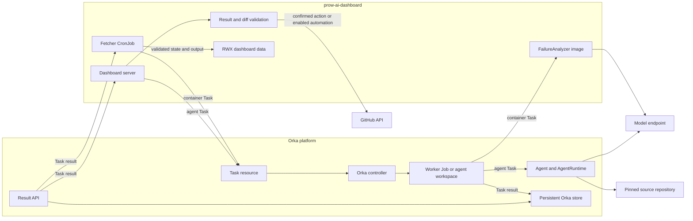

# Orka architecture in prow-ai-dashboard

Orka is an optional execution and lifecycle layer for Kubernetes deployments of
`prow-ai-dashboard`. It isolates long-running work, records Task state, and
provides result retrieval that survives controller restarts when the Orka store
is persistent. The dashboard continues to own analysis policy, evidence
quality, result validation, and every GitHub write.

This guide explains how the components fit together. See
[Orka integration](orka.md) for installation and Helm values. See
[Agent-proposed fix PRs](fix-prs.md) for feature configuration.

## Where Orka is used

| Integration | Orka execution | Status | Main benefit |
| --- | --- | --- | --- |
| Failure analysis | One `type: container` Task per failure | Experimental Helm watch or cron option | Isolation and per-failure Task history |
| Fix generation | `type: agent` Task using an AgentRuntime such as OpenCode | Optional | Isolated source workspace and structured diff result |
| Source investigation | Read-only `type: agent` Task at a pinned source revision | Optional | Deeper source inspection with verified citations |

In-process failure analysis remains the default and recommended production
runtime. Enabling one Orka integration does not enable the others.

## Component overview

Orka is installed as a separate cluster-level release. A cluster may serve
multiple dashboards from one Orka installation, while each dashboard keeps its
own data volume, analysis namespace, project configuration, and credentials.

## Ownership boundary

The most important rule is that Orka owns execution lifecycle, not dashboard
policy.

| Concern | Owner |
| --- | --- |
| Prompt composition and project knowledge | Dashboard and consumer |
| Tool schemas and diagnostic skills | Dashboard and consumer |
| Evidence planning, critique, and semantic review | Dashboard |
| Model calls for failure analysis | Dashboard analyzer |
| Task and worker lifecycle | Orka |
| Task retry, timeout, and execution history | Orka |
| Durable Task result retrieval | Orka with a persistent store |
| Cache acceptance and private trace schema | Dashboard |
| Fix diff and source citation validation | Dashboard |
| Public dashboard output | Dashboard |
| Final issue or pull request creation | Dashboard, based on confirmation and `dry_run` settings |

The removed patched Orka AI worker is not part of the supported design. New
analysis policy belongs in the dashboard-owned `FailureAnalyzer`, regardless of
whether it runs in-process or inside an Orka container Task.

## Failure analysis path

Helm deployments may select `analysisRuntime.type: orka-container` with
`mode: cron`.

1. The fetcher discovers a failed Prow test.
2. The dashboard builds a sanitized project bundle containing the request,
   prompt, skills, and a bounded cache seed. The bundle is stored in an
   immutable ConfigMap; only state returned by the analyzer is encrypted.
3. The dashboard creates a content-addressed Orka container Task in a dedicated
   analysis namespace.
4. Orka creates the worker Job using the pinned analyzer image and CPU
   placement policy.
5. The analyzer runs the same `FailureAnalyzer` used by the in-process path. It
   calls the model endpoint and uses dashboard-owned read-only Tools.
6. The analyzer returns `FailureAnalysisResult` plus encrypted cache and trace
   state.
7. The fetcher reads the result through the Orka result API, validates it, and
   merges accepted private state.
8. After all individual analyses finish, the fetcher persists authenticated
   cache and trace state and commits a private checkpoint before pattern work.
9. A failure before that checkpoint restores the prior private generation. A
   later pattern failure preserves the checkpoint and any successfully persisted
   pattern cache entries, invalidates in-memory runtimes, and leaves public and
   side-effect state unchanged. Otherwise, the fetcher publishes public JSON
   with per-file atomic replacement. Individual unavailable analyses may remain
   nonfatal.

Orka does not select evidence, define prompts, judge diagnoses, or decide which
analysis is safe to cache. It supplies isolation and Task lifecycle around the
existing dashboard analyzer.

## Fix generation path

Fix generation uses `ai.fix_prs.agent_runtime.type: orka`. The referenced Orka
Agent may select `spec.runtime.type: opencode`.

1. A maintainer requests a fix preview from a published analysis or validated
   chat finding.
2. The dashboard pins the source repository and base commit.
3. The dashboard creates an Orka agent Task with a read-only clone credential.
4. Orka prepares an isolated workspace and runs the configured AgentRuntime.
5. OpenCode edits the workspace. Orka captures the final workspace and creates
   the outer `StructuredResult`, including the base SHA, diff, and file list.
6. The dashboard rejects malformed results, unexpected files, unsafe paths,
   base mismatches, binary changes, deletions, and push instructions.
7. The dashboard may reconstruct the change in a clean workspace and run build
   or vet commands.
8. For on-demand actions, a maintainer reviews the preview before the dashboard
   uses its GitHub write credential. Scheduled reconciliation can open a draft
   automatically when the consumer enables it with `dry_run: false`.

The model's final text is a human-readable summary. It is not the authoritative
structured result contract.

## Source investigation path

Source investigation extends a completed analysis-chat response.

1. The dashboard binds the request to the authenticated session owner, build,
   analysis timestamp, and exact source commit.
2. It creates a read-only Orka agent Task at that pinned revision.
3. The Agent may inspect repository files but cannot use Bash, edit files,
   return a diff, or receive a GitHub write token.
4. The dashboard validates every returned path, line range, and quote against
   the same revision.
5. The verified finding is stored in the private analysis-chat session.

This path is for explaining source behavior. Fix generation is the separate path
that permits workspace edits and returns a diff.

## Credentials and trust boundaries

| Credential | Location | Used by | Never sent to |
| --- | --- | --- | --- |
| Dashboard model token | Dashboard namespace | Fetcher, pattern analysis, chat | Orka source workspace |
| Analyzer model token | Dedicated analysis namespace | Container analyzer Task | Public dashboard output |
| Projected source ServiceAccount token | Dashboard server pod | Source Task and result APIs; exact fix TokenRequest | GitHub or model provider |
| Pod-bound delegated fix ServiceAccount token | Dashboard server memory | Fix Task and result APIs | Source Task API, GitHub, model provider, or persistent storage |
| Agent model Secret | Orka namespace | OpenCode or another AgentRuntime | Dashboard public data |
| Read-only repository credential | Orka namespace | Source workspace initialization | GitHub write path |
| OAuth or bot write token | Dashboard namespace | Confirmed issue or PR creation | Orka Task or Agent |

The fix-generation and source-investigation ServiceAccounts receive separate
Task-only permissions. In a combined server pod, the source ServiceAccount can
request only a short-lived fix token bound to that Pod; it does not receive the
fix Task Role directly. Container analysis also receives narrow ConfigMap
permissions for its immutable input bundles. Broader Orka controller and worker
RBAC remains operator-owned.

## State and persistence

| State | Location | Purpose |
| --- | --- | --- |
| Public dashboard JSON | Dashboard RWX volume | SPA data contract |
| `ai_cache.json` | Dashboard RWX volume | Accepted analysis and pattern cache |
| `ai_traces.json` | Dashboard RWX volume | Private content-free execution traces |
| Analysis checkpoint | Dashboard RWX volume | Private cache and trace rollback baseline, distinct from public publication |
| `.analysis-chat` | Dashboard RWX volume | Owner-bound chat and source requests |
| Task resources | Kubernetes API | Lifecycle, phase, identity, and history |
| Task results | Orka persistent store | Durable result retrieval |
| Container state wrapper | Encrypted Task result | Cache and trace transfer from analyzer |

Orka Task identity stays in the Task and encrypted state wrapper. It is not added
to the dashboard's private analysis trace schema.

## How Orka improves the inference stack

Orka improves the operational control plane around inference:

- Per-request isolation and resource placement
- Bounded concurrency and backpressure
- Retry, timeout, cancellation, and Task history
- Durable result retrieval across process boundaries
- Isolated source workspaces for coding agents
- Independent scaling of dashboard, orchestration, and model serving
- Reproducibility through pinned images, revisions, and Task identity
- Clear separation between read-only analysis and write-capable fix workflows

Orka does not automatically improve:

- Prompt or model quality
- Evidence selection
- Root-cause accuracy
- Citation correctness
- Cache acceptance
- Safety of generated changes

Those remain model or dashboard responsibilities. Orka improves operability and
control, not reasoning quality by itself.

## Failure handling and observability

Start with the component that owns the failed stage:

| Symptom | Inspect first |
| --- | --- |
| Task was never created | Dashboard fetcher or server logs and RBAC |
| Task remains queued | Orka controller logs and placement constraints |
| Worker Job fails | Task status, Job, pod logs, image, and credentials |
| Model request fails | Analyzer or Agent logs and model endpoint health |
| Task succeeds but result is unavailable | Orka result API, store, and ServiceAccount authentication |
| Result is rejected | Dashboard validation logs and safe failure category |
| Refresh fails before publication | Fetcher transaction logs and prior data hashes |
| Fix preview fails | Agent Task, StructuredResult validation, and verification logs |

The dashboard trace UI reports dashboard-owned model and Tool execution. Orka
Task status and controller logs report orchestration lifecycle. Both are needed
for a complete investigation.

## Deployment and support status

| Capability | Current status |
| --- | --- |
| In-process failure analysis | Default and recommended production runtime |
| Orka container analysis | Experimental Helm-only cron option |
| Orka fix generation | Optional experimental upstream integration |
| Orka source investigation | Optional experimental upstream integration |
| Patched generic Orka AI worker | Removed |
| Orka installed as a dashboard subchart | Not supported |

Install Orka as a separate release and pin a verified chart and runtime images.
Orka currently labels the project experimental, so verify the required Agent
runtime against the pinned release or commit before enabling these paths.
See [Orka integration](orka.md) for installation, namespace, Secret, RBAC, and
placement requirements.

## Further reading

- [Orka integration](orka.md)
- [Kubernetes operator reference](kubernetes-reference.md)
- [Agentic analysis](agentic.md)
- [Agent-proposed fix PRs](fix-prs.md)
- [Server and analysis chat](server.md)
- [Failure analysis runtime evaluation](analysis-runtime-evaluation.md)
- [ADR 0001: Dashboard ownership of analysis policy](architecture-decisions/0001-analysis-runtime-ownership.md)

## Partial pattern refreshes

A provider or validation failure for one eligible job no longer blocks current dashboard, JUnit, search, or individual-analysis publication. The fetcher merges pattern outcomes per job with the prior complete job details. Retained verdicts keep their exact identity and are excluded from new side effects. Context cancellation, checkpoint persistence failure, corrupt prior pattern identity, and output failure remain fatal.
